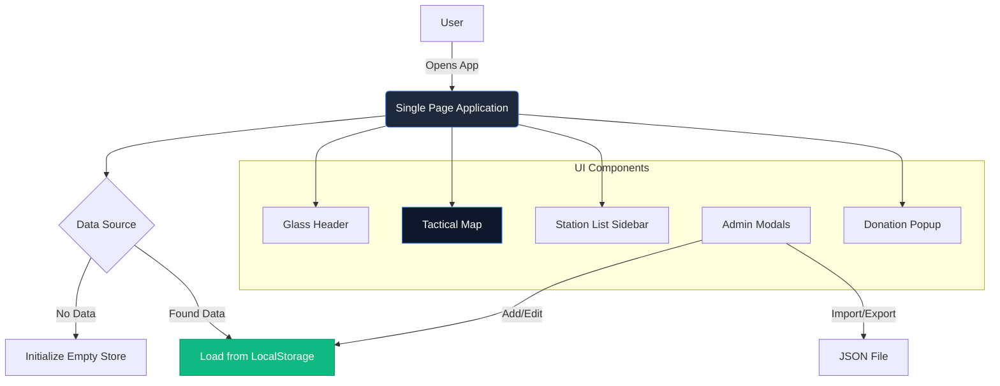

# 📡 9M2PJU SET Dashboard
> **Official Dashboard for Amateur Radio Simulated Emergency Tests (SET)**

---

## 🌟 Overview

The **9M2PJU SET Dashboard** is a premium, real-time command center designed for coordinating Amateur Radio emergency communication exercises. Built with modern web technologies, it offers a glassmorphic interface, offline-first data persistence, and interactive mapping capabilities.

### 🚀 Key Features
- **🗺️ Interactive Tactical Map**: Dark-mode tactical map powered by Leaflet.
- **💾 LocalStorage Persistence**: Data lives in your browser—no backend required.
- **📱 Native Mobile Experience**: PWA-ready with touch-optimized controls.
- **🔄 Import/Export Scenarios**: Share exercise setups via JSON configuration files.
- **⚡ Real-time Widgets**: Live UTC/Local clock and simulated weather telemetry.
- **📰 News Ticker**: Integrated real-time emergency news and updates ticker.
- **❤️ Donation Support**: Built-in contribution system with Malaysian National QR.

---

## 🛠️ Architecture

## 🖥️ Usage Guide

### Admin Mode
1. Click the **Settings (⚙️)** icon in the header.
2. Use **Export** to save your current station layout.
3. Use **Import** to load a pre-configured scenario.
4. Use **Clear Data** to reset the dashboard.

### Support the Project
- Click the **Heart (❤️)** icon in the header to view donation options.
- The dashboard supports **Malaysian National QR** (DuitNow) for seamless contributions to keep the service running.

### Managing Stations
- **Add**: Click the floating **(+)** button.
- **Edit/Delete**: Use the controls within the station list or map popups.
- **Locate**: Click any station in the sidebar to fly to its location.
- **Status**: Visual indicators for `Active`, `Inactive`, and `EMERGENCY`.

---

## 📦 Tech Stack

| Component | Technology | Description |
|-----------|------------|-------------|
| **Core** | React 19 + TypeScript | Lightning fast UI rendering |
| **Build** | Vite | Next-gen frontend tooling |
| **Style** | TailwindCSS | Utility-first CSS framework |
| **Map** | React Leaflet | Open-source mobile-friendly maps |
| **Icons** | Lucide React | Beautiful consistent icons |

---

## 🚀 Deployment

This project is configured for **GitHub Pages**.

1. **Build**: `npm run build`
2. **Commit**: Push changes to `main`.
3. **Verify**: GitHub Actions will deploy to `set.hamradio.my`.

---

  Built with ❤️ by 9M2PJU Team

