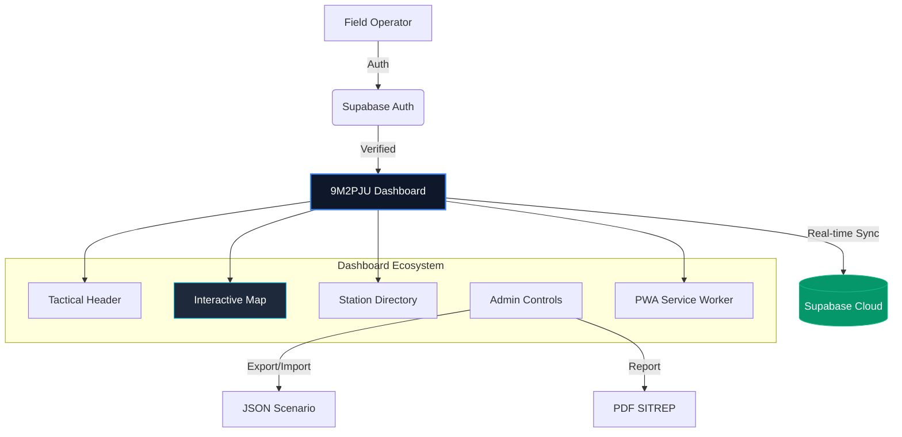

# 📡 9M2PJU Amateur Radio SET Dashboard
> **Premium Tactical Command Center for Amateur Radio Simulated Emergency Tests**

---

## 🌟 Overview

The **9M2PJU Amateur Radio Simulated Emergency Test (SET) Dashboard** is a state-of-the-art, real-time command center designed for coordinating amateur radio emergency communication exercises. It provides a mission-critical interface for Net Control Stations (NCS) to track field units, verify signal coverage, and manage emergency telemetry.

### 🚀 Mission-Critical Features
- **🗺️ Interactive Tactical Map**: High-performance mapping with OSM integration and offline tile caching.
- **⚡ PWA & Offline Ready**: Install as a native app on Desktop/Mobile with Service Worker support for field use.
- **☁️ Real-time Cloud Sync**: Powered by Supabase for instantaneous data updates across all stations.
- **🔐 Secure Access Control**: Integrated Auth Gate ensures data integrity and user accountability.
- **📱 Responsive Excellence**: Perfectly balanced UI for both wide-screen monitors and field-duty mobile devices.
- **📄 Pro SITREP Generation**: One-click PDF export with integrated branding for official reporting.
- **📍 Precise Navigation**: Live coordinates, 6-digit Maidenhead Grid Squares, and "Fly To" station locating.
- **📰 Tactical Awareness**: Live UTC/Local clock, local weather radar, and a real-time news ticker.

---

## 🛠️ System Architecture

---

## 🖥️ Operational Guide

### 🛡️ Authentication
Users must sign in via the **Auth Gate** to access the dashboard. Registration is available for new operators to manage their own station data within the cloud synchronization layer.

### 📡 Managing Stations
- **Deploy**: Use the floating **(+)** button or tap long on the map to place a station.
- **Intelligence**: Click any station on the map or in the directory to view detailed operator info, radio frequency, and power status.
- **Tactical**: Use the **"Locate"** feature (LocateFixed icon) in the directory to instantly focus the map on a specific unit.

### 📋 Reporting (SITREP)
Generate official **Emergency Situation Reports (PDF)** from the Settings menu. Reports include full telemetry logs, operator details, and project branding.

### 💾 Offline Use
Designed for field operations. The dashboard uses **PWA Service Workers** to cache map tiles and application assets. Simply click **"Install App"** in the header to use it as a standalone tactical tool.

---

## 📦 Technical Specification

| Layer | Technology | Role |
|-----------|------------|-------------|
| **Core** | React 19 + TypeScript | Application Logic & State |
| **Styling** | Vanilla CSS + Tailwind | Premium Glassmorphic UI |
| **Persistence**| Supabase PostgreSQL | Military-grade Data Store |
| **Map Engine** | Leaflet JS | Tactical Geographic Visualization |
| **Caching** | Vite PWA | Offline Reliability |
| **Exports** | jsPDF + AutoTable | SITREP Generation |

---

## 👨‍💻 Author & Support
Created with ❤️ by **9M2PJU** for the Malaysian Amateur Radio community.

- **Website**: [hamradio.my](https://hamradio.my)
- **Support**: Use the **Heart (❤️)** button in the dashboard to contribute via DuitNow QR.

---

  9M2PJU SET DASHBOARD • STABLE RELEASE 4.4.0 • 2026

